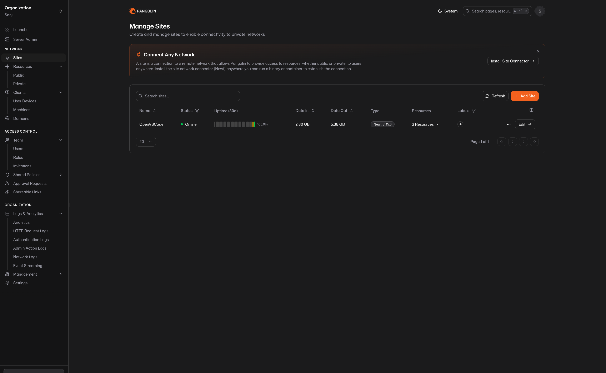

# Pangolin Tunnel on AWS

**Tech Stack:** AWS EC2 • Docker • Docker Compose • Pangolin • Gerbil • Traefik • Cloudflare DNS • Let's Encrypt • Linux

## Overview

This project documents the deployment of Pangolin on AWS as a secure, self-hosted tunnel solution for publishing services over the internet.

Pangolin provides an alternative to managed tunnelling services by allowing secure inbound access through infrastructure that you fully control. The deployment combines Pangolin, Gerbil and Traefik to provide encrypted connectivity, automatic TLS certificate management and reverse proxy functionality.

The solution is hosted on an AWS EC2 instance using Docker Compose and integrates with Cloudflare DNS for certificate validation.

---

## Project Objectives

The objectives of this project were to:

- Deploy Pangolin on AWS using Docker Compose
- Provide secure remote access without relying on third-party tunnel providers
- Automatically issue and renew TLS certificates
- Integrate Traefik as the reverse proxy
- Configure Gerbil for secure networking
- Build a lightweight and maintainable ingress solution
- Gain practical experience deploying secure cloud infrastructure

---

## Architecture



Internet traffic is directed to an AWS EC2 instance where Traefik terminates HTTPS connections and routes requests to Pangolin. Gerbil manages the secure tunnel communication while Cloudflare DNS is used for ACME DNS validation.

---

## Technologies Used

- AWS EC2
- Docker
- Docker Compose
- Pangolin
- Gerbil
- Traefik
- Cloudflare DNS
- Let's Encrypt
- Linux
- YAML

---

## Repository Structure

```text
pangolin-aws/
├── README.md
├── docker-compose.yml
├── .env.example
├── .gitignore
├── config/
├── images/
│   └── architecture.png
└── docs/
```

---

## Design Decisions

### AWS EC2

AWS EC2 provides a reliable cloud environment with full administrative control over the operating system and networking configuration.

### Pangolin

Pangolin was selected as a self-hosted alternative to managed tunnelling services, allowing complete control over infrastructure and traffic.

### Traefik

Traefik automatically discovers services, manages HTTPS certificates and provides reverse proxy functionality without requiring manual configuration for each application.

### Cloudflare DNS Challenge

Using the DNS challenge allows certificates to be issued even when services are not directly exposed during initial deployment.

### Docker Compose

Docker Compose provides a simple and repeatable deployment that can be recreated on another server with minimal configuration changes.

---

## Deployment

Clone the repository:

```bash
git clone https://github.com/sanju-mathew/pangolin-aws.git
cd pangolin-aws
```

Create the environment file:

```bash
cp .env.example .env
```

Update the required environment variables.

Deploy the stack:

```bash
docker compose up -d
```

Verify the deployment:

```bash
docker compose ps
```

View logs:

```bash
docker compose logs -f
```

---

## Validation

After deployment I verified:

- Pangolin started successfully
- Gerbil established communication
- Traefik detected the services
- HTTPS certificates were issued successfully
- DNS resolution functioned correctly
- Secure external access was available
- Containers remained healthy after restart

---

## Security Considerations

This deployment incorporates several security practices:

- HTTPS using Let's Encrypt
- Cloudflare DNS validation
- Environment variables used for sensitive credentials
- Containers configured with restart policies
- `no-new-privileges` enabled where appropriate
- Docker Compose configuration stored in version control while secrets remain excluded

---

## Engineering Outcomes

This project strengthened my practical understanding of:

- AWS infrastructure
- Docker networking
- Reverse proxy architecture
- TLS certificate automation
- Cloudflare DNS integration
- Secure remote access
- Infrastructure troubleshooting
- Linux system administration
- Infrastructure documentation

---

## Potential Enhancements

Possible future improvements include:

- Deploy multiple Pangolin nodes for high availability
- Integrate Prometheus monitoring
- Add Grafana dashboards
- Protect services using CrowdSec
- Automate deployment using Infrastructure as Code
- Implement automated backups for configuration

---

## Skills Demonstrated

- AWS EC2
- Docker
- Docker Compose
- Pangolin
- Traefik
- Cloudflare DNS
- Let's Encrypt
- Linux Administration
- Networking
- Infrastructure Security
- YAML
- Technical Documentation

---

## Further Reading

A detailed walkthrough of this deployment is available on my blog:

https://homelab.sanjuprojects.uk/pangolin-in-aws/